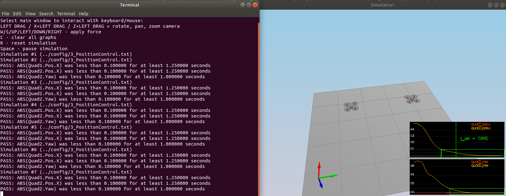

# The C++ Project 3 Writeup #

This is the writeup for the C++ controller project.

## The Code ##

All of the code for the controller can be found in `src/QuadControl.cpp`.

All the configuration files for the controller and the vehicle are in the `config` directory.  The control gains and other desired tuning parameters are in a config file called `QuadControlParams.txt`.

Different scenarios are considered, with increasing degree of difficulty to test the various part of the controller implemented.

### Scenario 1: correct quad mass ###

In `QuadControlParams.txt` the estimated mass of the vehicle has been set to 0.5 kg to make the vehicle stay in the same spot.

### Scenario 2:  body rate and roll/pitch control ###

In this scenario, there is a quad above the origin.  It is created with a small initial rotation speed about its roll axis.  The controller will need to stabilize the rotational motion and bring the vehicle back to level attitude.

To accomplish this, the following steps have been performed, i.e. the body-rate and the roll-pitch controls have been implemented.

 1. Implement the code in the function `GenerateMotorCommands()`  

    The function takes as inputs the desired collective thrust and moments about each axis. As output it gives the desired thrust per motor. To compute the desired thrust per motor a system of four equations (equilibrium in z direction of the forces and about the three axis for the moments) with four unknowns has to be solved.

 2. Implement the code in the function `BodyRateControl()`

     The function returns the desired moments for each of the three axis given the desired and the estimated body rates. A proportional controller is employed with gains `kpPQR`.

 3. Implement the code in the function `RollPitchControl()`

    This function calculate the desired pitch and roll angle rates based on a desired global lateral acceleration, the current attitude of the quad, and the desired collective thrust command. Note that the rotation matrix is necessary to switch reference system. Also note that the z-direction is left to 0 here. A proportional controller is implemented with gain `kpBank`.

The gains `kpPQR` in `QuadControlParams.txt` are set to (90, 90, 6) to get the vehicle to stop spinning quickly but not overshoot, while `kpBank` is set to 11 to minimize settling time but avoid too much overshoot.

The rotation of the vehicle about roll (omega.x) get controlled to 0. Including the roll-pitch control the quad level itself (as shown below), though it’ll still be flying away slowly since we’re not controlling velocity/position! Both checks are marked as PASSED.

### Scenario 3: position/velocity and yaw angle control ###

For this scenario, the position, altitude and yaw control have been implemented.  This scenario creates 2 identical quads, both with the same offset from their target points, but one initialized with yaw = 0 and the other one with yaw = 45 degrees. The following steps have been followed.

 1. Implement the code in the function `LateralPositionControl()`

    The desired lateral accelerations are computed based on desired lateral position, velocity and acceleration and the current position. The z-component is set to 0. The acceleration is limited to the maximum lateral value given in the parameter file.

 2. Implement the code in the function `AltitudeControl()`

    A PD controller here is implemented based on the equations given in lecture 4, with the additional check to limit the vertical velocity in the range (-maxDescentRate, maxAscentRate). The output is a thrust command.

 3. Implement the code in the function `YawControl()`

    A proportional controller which gives the desired yaw rate is implemented. The function takes as inputs the commanded and current yaw, and returns the desired yaw rate. Note that the yaw angle has an upper limit, i.e. 2*PI.

Once the functions have been implemented,

 - tune parameters `kpPosZ` and `kpPosZ`
 - tune parameters `kpVelXY` and `kpVelZ`
 - tune parameters `kpYaw` and the 3rd (z) component of `kpPQR`

and the quads should behave like in the animation below.

